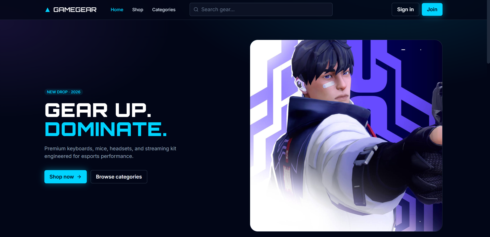
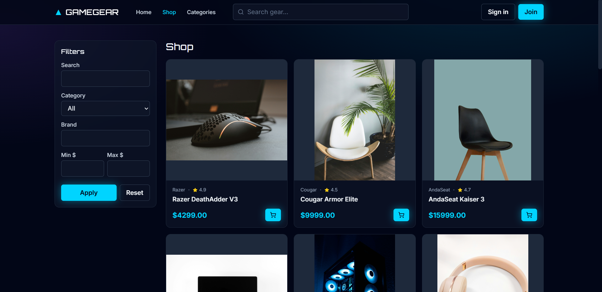
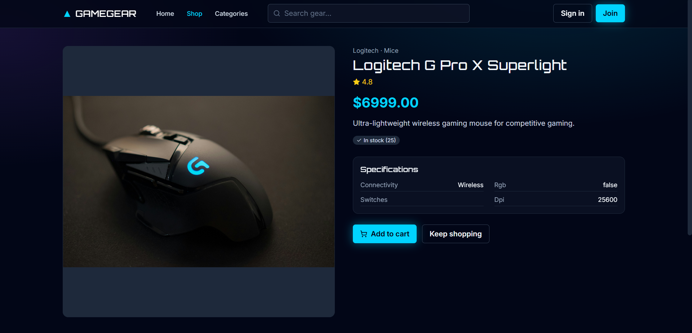
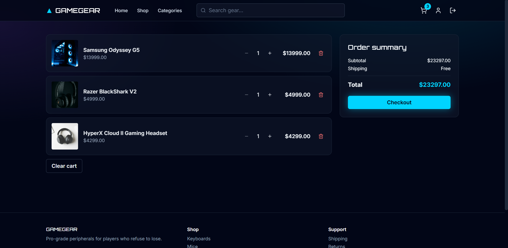
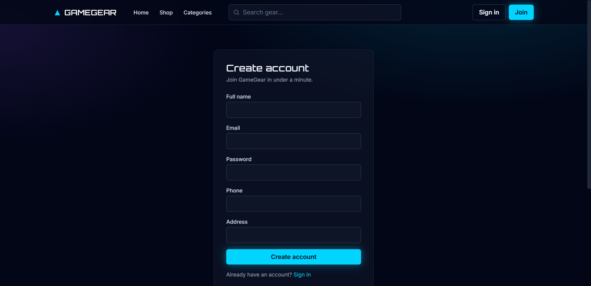
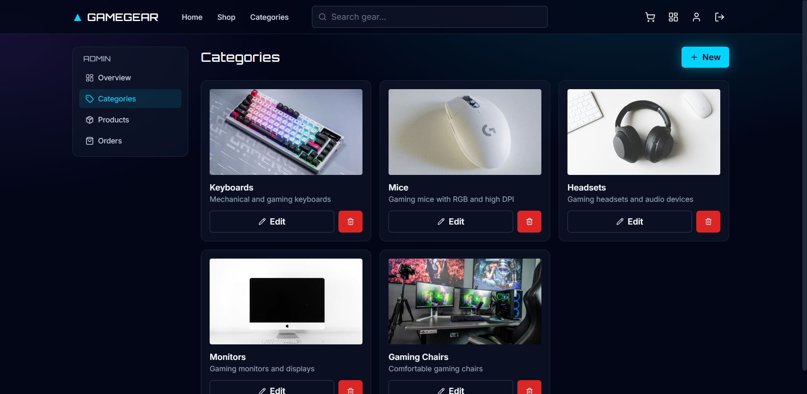

# GameGear Store

## Overview

GameGear Store is a full-stack E-Commerce platform developed for selling gaming accessories and gaming-related products through a modern web application.

The platform provides:
- Product browsing
- Product filtering and searching
- Authentication and authorization
- Cart management
- Order management
- Admin product management
- Responsive frontend integration

The project follows a scalable backend architecture using REST APIs and cloud deployment services.

---

# Technologies Used

## Backend
- Node.js
- Express.js
- MongoDB Atlas
- Mongoose
- JWT Authentication
- bcryptjs
- Multer
- express-validator

## Frontend
- Modern JavaScript frontend framework
- Axios / Fetch API
- Responsive UI Design

## Deployment
- Frontend: Vercel
- Backend: Render
- Database: MongoDB Atlas

---

# Project Architecture

The backend follows a modular scalable architecture:

```txt
backend/
│
├── src/
│   │
│   ├── config/
│   ├── controllers/
│   ├── middleware/
│   ├── models/
│   ├── routes/
│   ├── validations/
│   ├── utils/
│   ├── uploads/
│   │
│   ├── app.js
│   └── server.js
│
├── .env
├── package.json
└── README.md
```

---

# Main Features

## Authentication System
- User registration
- User login
- JWT authentication
- Protected routes
- Role-based authorization

## Products System
- Product CRUD APIs
- Product filtering
- Product searching
- Product image uploads

## Categories System
- Categories CRUD APIs

## Cart System
- Add products to cart
- Update quantities
- Remove items from cart

## Orders System
- Create orders
- Order history
- Order status updates

## Frontend Integration
- Responsive user interface
- API integration
- Dynamic product pages
- Cart and checkout pages

---

# Database Collections

The project uses MongoDB Atlas with the following collections:
- Users
- Categories
- Products
- Cart
- Orders

---

# Development Workflow

The project was developed in multiple phases:

## Phase 1 — Project Setup
- Backend setup
- MongoDB Atlas connection
- Environment configuration
- GitHub repository structure

## Phase 2 — Database Design
- Mongoose schemas
- Database relationships
- Validations

## Phase 3 — Authentication
- JWT authentication
- Password hashing
- Protected routes

## Phase 4 — Products & Categories
- CRUD APIs
- Filtering and searching
- Image uploads

## Phase 5 — Cart & Orders
- Cart logic
- Order creation
- Stock management

## Phase 6 — Frontend Integration
- API integration
- UI pages
- Authentication flow

## Phase 7 — Testing & Deployment
- API testing
- Deployment preparation
- Cloud hosting setup

---

# API Features

## Authentication APIs
- Register
- Login
- User profile

## Products APIs
- Create product
- Update product
- Delete product
- Get all products
- Filter products

## Categories APIs
- Create category
- Update category
- Delete category
- Get categories

## Cart APIs
- Add to cart
- Update quantity
- Remove item
- Get cart

## Orders APIs
- Create order
- Get orders
- Update order status

---

# Security & Validation

The project includes:
- Password hashing using bcrypt
- JWT authentication
- Protected API routes
- Role middleware
- Request validation
- Error handling middleware

---

# Deployment

## Frontend Deployment
The frontend application is deployed using Vercel.

Frontend URL:
```txt
https://gamegear-store.vercel.app
```

## Backend Deployment
The backend APIs are deployed using Render.

Backend URL:
```txt
https://gamegear-store.onrender.com
```

## Database Hosting
MongoDB Atlas is used as the cloud database server.

---

# Screenshots

## Home Page


---

## Products Page


---

## Product Details Page


---

## Cart Page


---

## Login Page


---

## Admin Dashboard


---

# Installation

## Clone Repository

```bash
git clone https://github.com/Abdo-Hafez-0/gamegear-store.git
```

---

## Backend Setup

```bash
cd backend
npm install
```

Create `.env` file:

```env
PORT=5000
MONGO_URI=your_mongodb_atlas_connection_string
JWT_SECRET=your_secret_key
```

Run backend:

```bash
npm run dev
```

---

# Team Structure

| Member | Responsibility |
|---|---|
| Member 1 | Authentication & Users |
| Member 2 | Products & Categories |
| Member 3 | Cart & Orders |
| Member 4 | Frontend Development |
| Member 5 | Testing & Documentation |

---

# Project Status

The project is fully developed as a scalable full-stack E-Commerce platform using:
- Render for backend deployment
- Vercel for frontend deployment
- MongoDB Atlas for cloud database hosting
- GitHub for team collaboration and version control